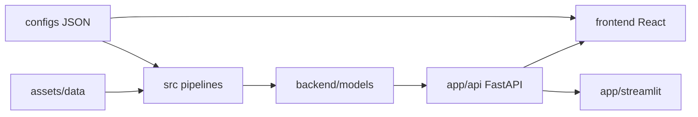

# Credit Risk PD & Stress Testing Engine

Production-oriented data science project for **Probability of Default (PD)** modeling, macroeconomic **stress testing**, and regulatory **Expected Credit Loss (ECL)** calculations.

## Overview

End-to-end credit risk platform combining a modular ML library, FastAPI service layer, and dual dashboards (React + Streamlit). Trains dual classifiers on loan-level data, applies calibration and scorecard mapping, and exposes PD prediction, portfolio stress testing, and monitoring APIs.

## Problem Statement

Financial institutions need interpretable PD estimates under baseline and stressed macro scenarios. This project demonstrates a complete pipeline—from feature engineering through model governance—to support internal risk analysis and regulatory ECL prototyping.

## Features

- **Dual PD models**: Logistic Regression + XGBoost with shared preprocessing
- **Stress testing**: Normal / Boom / Recession macro scenarios with PD shocks
- **Risk scoring**: PD → scorecard (300–850), risk bands, EL = PD × LGD × EAD
- **Regulatory ECL (MVP)**: Basel IRB, IFRS 9 staging, CECL lifetime proxy
- **Explainability**: SHAP contributions and adverse-action reason codes
- **Governance**: Model registry, promotion gates, drift monitoring (PSI), audit trail

> Educational MVP — not for production regulatory submission. See [Model Card](docs/MODEL_CARD.md).

## Tech Stack

| Layer | Technology |
|-------|------------|
| ML | Python 3.12, scikit-learn, XGBoost, SHAP |
| API | FastAPI, Uvicorn, Pydantic |
| UI | React 18 + Vite, Streamlit |
| State | Redis (optional), SQLite audit store |
| Infra | Docker Compose, GitHub Actions CI |

## Architecture



## Project Structure

```text
├── app/
│   ├── api/              # FastAPI REST service
│   └── streamlit/        # Internal Streamlit UI
├── src/
│   ├── data/             # Data loaders, integrity checks
│   ├── features/         # Engineering, preprocessing
│   ├── models/           # Scoring, ECL, registry, schemas
│   ├── pipelines/        # Train, predict, monitoring
│   ├── utils/            # Metrics, I/O, display helpers
│   └── config/           # Constants, JSON config loader
├── frontend/             # React dashboard
├── infra/                # Docker Compose
├── notebooks/            # Model evaluation notebook
├── tests/                # pytest (src/ + app/)
├── assets/data/          # Credit CSV + macro Excel
├── configs/              # Shared JSON contracts
├── docs/                 # Model card, auth, scaling guides
├── main.py               # API entry point
└── requirements.txt
```

## Installation

### Prerequisites

- Python 3.10+
- Node.js 18+ (React frontend)

### Setup

```bash
python -m venv .venv

# Windows PowerShell
.\.venv\Scripts\Activate.ps1

# macOS/Linux
source .venv/bin/activate

pip install -r requirements.txt
copy .env.example .env   # Windows
# cp .env.example .env   # macOS/Linux
```

### Generate macro data

```bash
python -m src.utils.generate_macro
```

## Configuration

Copy [`.env.example`](.env.example) to `.env`. Key variables:

| Variable | Default |
|----------|---------|
| `DATA_CSV_PATH` | `assets/data/credit_risk_dataset_new.csv` |
| `MACRO_XLSX_PATH` | `assets/data/US_Macro_Economic_Stress_Test_Data.xlsx` |
| `MODEL_DIR` | `backend/models` |
| `API_KEY` | Required outside development |
| `AUTH_MODE` | `api_key` or `oauth2` — see [docs/AUTH.md](docs/AUTH.md) |
| `REDIS_URL` | Optional; required for multi-worker rate limiting |

## Usage

### Start API

```bash
python main.py
# or: uvicorn app.api.main:app --reload --host 0.0.0.0 --port 8000
```

API docs: http://localhost:8000/docs

### Train models

```bash
python -m src.pipelines.train
# or POST http://localhost:8000/train
```

Artifacts saved to `backend/models/`.

### React frontend

```bash
cd frontend && npm install && npm run dev
```

Open http://localhost:5173

### Streamlit UI (internal only)

```bash
streamlit run app/streamlit/app.py
```

### Docker

```bash
docker compose -f infra/docker-compose.yml up --build
```

## Training Pipeline

1. Load credit CSV from `assets/data/`
2. Stratified train/holdout split (pre-feature-engineering)
3. Feature engineering: income transform, DTI, bucketing, imputation, one-hot encoding
4. Train LR + XGBoost; select best model by holdout ROC AUC
5. Calibrate (Platt/isotonic); compute CV metrics
6. Save artifacts + register version under `backend/models/registry/`

## Inference

`POST /predict` accepts single or batch loan inputs. Returns PD, scorecard, risk band, ECL, SHAP contributions, and reason codes. Audit records stored in SQLite.

## API / UI

| Endpoint | Method | Description |
|----------|--------|-------------|
| `/health` | GET | Health check + model status |
| `/train` | POST | Start background training job |
| `/metrics` | GET | Model metrics + feature importance |
| `/predict` | POST | Single or batch PD prediction |
| `/stress_test` | POST | Portfolio stress test |
| `/monitoring/drift` | GET | PSI drift report |
| `/predict/audit/{id}` | GET | Prediction audit record |

## Dataset

| File | Description |
|------|-------------|
| `assets/data/credit_risk_dataset_new.csv` | Loan-level data; target `loan_status` (0/1) |
| `assets/data/US_Macro_Economic_Stress_Test_Data.xlsx` | Macro scenarios: Normal, Boom, Recession |

## Model

Dual classifier (Logistic Regression + XGBoost) with Platt/isotonic calibration. Best model selected by holdout ROC AUC. See [Model Card](docs/MODEL_CARD.md) for validation approach and limitations.

## Evaluation Metrics

ROC AUC, F1, precision, recall, accuracy, KS statistic, Gini coefficient. Repeated stratified k-fold CV (5×3) reported in `metrics.json`. Full evaluation in [`notebooks/credit_risk_model_full_evaluation.ipynb`](notebooks/credit_risk_model_full_evaluation.ipynb).

## Results

Training metrics and feature importance available via `GET /metrics` after training. The evaluation notebook covers EDA, model comparison, confusion matrices, lift charts, and stress test examples.

## Future Improvements

- True out-of-time validation with origination dates
- PostgreSQL audit store for multi-instance deployment
- Enterprise SSO integration (see [docs/AUTH.md](docs/AUTH.md))
- Production model governance and champion/challenger automation

## Requirements

See [`requirements.txt`](requirements.txt) for all Python dependencies (runtime, testing, linting, and notebooks).

